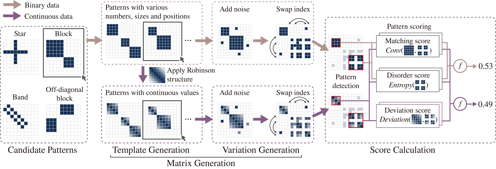

# ReorderBench: A Benchmark for Matrix Reordering

This repository contains the code for generating benchmark data, unified scoring models, and reordering models described in our paper "ReorderBench: A Benchmark for Matrix Reordering". You can get more detailed instructions through the README files in each part. For more information, please visit https://reorderbench.github.io/.

## Generate Data

Check the folder `generator`. 

Generate matrices with different visual patterns (block, off-diagonal block, star, band) and types (binary, continuous) using `reorderbench_generator`.

## Unified Scoring Models

Check the folder `unified_scoring_model`.

We build unified scoring models based on ReorderBench. These models align with the convolution- and entropy-based scoring method across all four visual patterns in both binary and continuous matrices and can also measure matrices of varying sizes. 

These models can be used to reproduce the scoring results on the ReorderBench test set or to evaluate the quality of visual patterns in any matrix.

## Reordering Models

Check the folder `reordering_model`.

By treating the matrices with index swaps as negative samples and their ground-truth matrices as positive samples, we build deep models for matrix reordering.

These models can be used to reproduce the reordering results of the ReorderBench test set or to reveal the visual patterns of a given matrix.

## Contact

If you have any problem with our code, feel free to contact reorderbench@gmail.com or open an issue.

